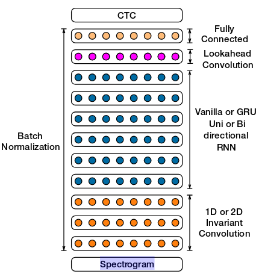

# 基于tensorflow的语音识别系统
## 简介
基于 tensorflow 的中文语音识别框架, 模型结构参考 百度[Deepspeech2](http://proceedings.mlr.press/v48/amodei16.pdf) 的论文,训练语料采用Aishell 170 小时数据. 模型结构如下图所示:

## 运行
* 进入example/aishell 修改 run_data.sh 内相关存储路径后，运行该脚本生成 manfest.{train,dev,test} 文件 与 vocab.txt
* 运行 train.py 训练模型

## TODO
* ~~根据论文修改模型结构~~    
* ~~实现 server/ client的调用~~  
* ~~使用CTC对输出进行解码~~  
* 输入改为语谱图 
* 全局使用 Batch Normalization

## Ref
以 [xxbb1234021/speech_recognition](https://github.com/xxbb1234021/speech_recognition) 为基础进行修改
